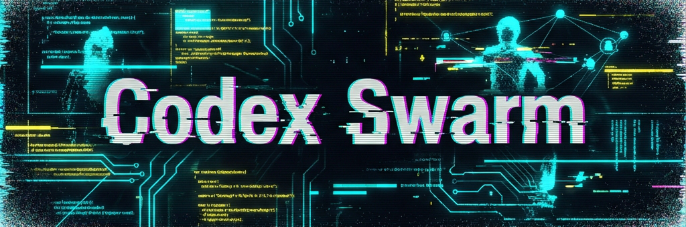

# Codex Swarm


Codex Swarm turns your local IDE + OpenAI Codex plugin into a predictable multi-agent workflow. It fixes the “just chat with the model” chaos by adding a small, opinionated layer: JSON-defined agents, a shared task board, and commit rules so every change is planned and traceable. There is no separate runner or daemon—everything lives in this repo and flows through the plugin you already use. It’s tighter than “ChatGPT + my IDE” because the orchestrator plans, delegates, and keeps docs/tasks in sync instead of leaving breadcrumbs in a chat log.

## Getting Started

Prerequisites:
- OpenAI Codex plugin (Cursor / VS Code / JetBrains) configured for your repo
- Git and Python 3.10+ installed locally

1. Clone the repo:
   git clone https://github.com/basilisk-labs/codex-swarm.git
   cd codex-swarm

2. Open this folder in your IDE with the OpenAI Codex plugin enabled.

3. Start with the ORCHESTRATOR:
   - Describe a goal (e.g. “Add a new agent that keeps CHANGELOG.md in sync”).
   - The ORCHESTRATOR will propose a plan, map steps to PLANNER/CODER/REVIEWER/DOCS and ask for approval.

4. Task board:
   - Track active work in branch-local `tasks-<branch>.json` on feature branches.
   - After a branch merges to `main`, INTEGRATOR/ORCHESTRATOR imports DONE tasks into `tasks.json` and runs `python scripts/tasks.py` to refresh `tasks.md`.
   - `tasks.json` is read-only while on feature branches; `tasks.md` stays generated.

5. Optional (recommended for a clean slate):
   - Run `./clean.sh` to remove the bundled project files, reinitialize the git repo, and reuse the framework for any tasks you want to orchestrate locally.

## Example: auto-doc for a tiny refactor

1. User: “Refactor utils/date.ts and update the README accordingly.”
2. ORCHESTRATOR: proposes a plan and maps steps to PLANNER/CODER/REVIEWER/DOCS.
3. PLANNER: creates T-041 (refactor) and T-042 (docs) inside `tasks-feature-date-refactor.json`, sets them to DOING, and keeps the branch-local backlog updated.
4. CODER: edits `utils/date.ts`, updates `README.md`, runs any checks, and commits with an emoji message like “🔧 T-041 refactor date utils”.
5. REVIEWER or DOCS: verifies the diff, adds a short review comment, and marks the tasks DONE in the branch-local file.
6. INTEGRATOR (after merge to `main`): imports DONE tasks into `tasks.json` on `main` and runs `python scripts/tasks.py` so `tasks.md` reflects the history.

## Limitations / Non-goals

- Codex Swarm is a prompt + JSON framework that assumes the OpenAI Codex plugin as the runtime; there is no standalone agent runner yet.
- All file operations happen in your local repo; the model only sees what the plugin sends from the IDE session.
- It is designed for orchestrated, human-in-the-loop workflows—not autonomous deployments or remote execution.
- Network calls or external tooling only happen when you explicitly run them from your IDE; the framework itself does not fetch data on its own.

## ✨ Highlights

- 🧠 **Orchestrated specialists:** Every agent prompt lives in `.AGENTS/*.json` so the orchestrator can load roles, permissions, and workflows dynamically.
- 🧭 **Workflow guardrails:** The global instructions in `AGENTS.md` enforce approvals, planning, and emoji-prefixed commits so collaboration stays predictable.
- 📝 **Docs-first cadence:** Branch-local `tasks-<branch>.json` tracks active work; INTEGRATOR updates `tasks.json` on `main` and runs `python scripts/tasks.py` so `tasks.md` stays in sync after merges.

## 🚀 How It Works

1. 🧭 **Orchestrator-focused contract.** `AGENTS.md` defines only the global rules, shared state, and the ORCHESTRATOR agent. The orchestrator interprets the user’s goal, drafts a plan, requests approval, and delegates work to other agents.
2. 📦 **External agent registry.** Every non-orchestrator agent lives in `.AGENTS/<ID>.json`. When the IDE loads this repository, it dynamically imports each JSON document and registers the agent ID, role, permissions, and workflow.
3. 📑 **Shared task state.** Active work lives in branch-local `tasks-<branch>.json` files; after a feature branch merges, INTEGRATOR updates the DONE-only `tasks.json` on `main` and runs `scripts/tasks.py` to regenerate the human-readable `tasks.md`.
4. 🧰 **Plugin-agnostic operation.** Because the instructions are plain Markdown and JSON, any IDE that supports the Codex Plugin can execute the same flows without extra configuration.
5. 🎯 **Optimization audits (optional):** When the user explicitly asks for agent improvements, the orchestrator triggers `@.AGENTS/UPDATER.json` so it can inspect `.AGENTS/*.json` and the rest of the repo before outlining targeted follow-up tasks.

### Agent spotlight: INTEGRATOR
- Runs only on `main` after a feature branch merges.
- Reads branch-local `tasks-<branch>.json`, imports DONE tasks into `tasks.json`, removes the branch file, and runs `python scripts/tasks.py` to refresh `tasks.md`.
- Ensures `tasks.json`/`tasks.md` stay DONE-only history; feature branches must not edit `tasks.json` directly.

## 🗂️ Repository Layout

```
.
├── AGENTS.md
├── LICENSE
├── README.md
├── tasks.json
├── tasks.md
├── scripts
│   └── tasks.py
└── .AGENTS/
    ├── PLANNER.json
    ├── CODER.json
    ├── REVIEWER.json
    ├── DOCS.json
    ├── CREATOR.json
    └── UPDATER.json
```

| Path | Purpose |
| --- | --- |
| `AGENTS.md` | 🌐 Global rules, commit workflow, and the ORCHESTRATOR specification (plus the JSON template for new agents). |
| `.AGENTS/PLANNER.json` | 🗒️ Defines how tasks are added/updated inside branch-local `tasks-<branch>.json`. |
| `.AGENTS/CODER.json` | 🔧 Implementation specialist responsible for code or config edits tied to task IDs. |
| `.AGENTS/REVIEWER.json` | 👀 Performs reviews, verifies work, and flips task statuses accordingly. |
| `.AGENTS/DOCS.json` | 🧾 Keeps README and other docs synchronized with recently completed work. |
| `.AGENTS/CREATOR.json` | 🏗️ On-demand agent factory that writes new JSON agents plus registry updates. |
| `.AGENTS/UPDATER.json` | 🔍 Audits the repo and `.AGENTS` prompts when explicitly requested to outline concrete optimization opportunities and follow-up tasks. |
| `.AGENTS/INTEGRATOR.json` | 🔄 Imports DONE tasks into `tasks.json` on `main` after merges and regenerates `tasks.md`. |
| `tasks-<branch>.json` | 🗂️ Branch-local backlog for active work in each feature branch. |
| `tasks.json` | 📊 DONE-only history on `main` with status, priority, description, tags, comments, and commit links. |
| `tasks.md` | 📋 Generated human-readable view of DONE tasks from `tasks.json` on `main` (do not edit by hand). |
| `scripts/tasks.py` | ⚙️ Utility script that reads `tasks.json` on `main` and rewrites `tasks.md` so both stay in sync. |
| `README.md` | 📚 High-level overview and onboarding material for the repository. |
| `LICENSE` | 📝 MIT License for the project. |
| `assets/` | 🖼️ Contains the header image shown on this README and any future static visuals. |
| `clean.sh` | 🧹 Cleans the repository copy and restarts `git` so you can reuse the snapshot as your own local project. |

## 🧬 Agent Lifecycle

1. 🗺️ **Planning:** The ORCHESTRATOR reads `AGENTS.md`, loads `.AGENTS/*.json`, and creates a plan that maps each step to a registered agent (e.g., PLANNER, CODER, REVIEWER, DOCS).
2. ✅ **Approval:** The user can approve, edit, or cancel the plan before any work starts.
3. 🛠️ **Execution:** The orchestrator switches `agent_mode` according to the plan, allowing each agent to follow its JSON-defined workflow inside the IDE while updating the branch-local `tasks-<branch>.json`.
4. 📈 **Progress tracking + integration:** Statuses and comments live in `tasks-<branch>.json` during branch work; after merging to `main`, INTEGRATOR imports DONE tasks into `tasks.json` and reruns `python scripts/tasks.py` so `tasks.md` reflects the integrated history.
5. 🎯 **Optimization audits (optional):** When the user explicitly asks for agent improvements, the orchestrator triggers `@.AGENTS/UPDATER.json` so it can inspect `.AGENTS/*.json` and propose targeted follow-up tasks.

This structure lets you string together arbitrary workflows such as code implementation, documentation refreshes, research digests, or task triage—all from the same IDE session.

## 🧾 Commit Workflow

- The workspace is always a git repository, so every meaningful change must land in version control.
- Each atomic task listed in the branch-local `tasks-<branch>.json` maps to exactly one commit with a concise, meaningful emoji-prefixed message (ideally referencing the task ID).
- The agent that performs the work stages and commits before handing control back to the orchestrator, briefly describing the completed plan item so the summary is obvious, and the orchestrator pauses the plan until that commit exists.
- Step summaries mention the new commit hash and confirm the working tree is clean so humans can audit progress directly from the conversation.
- If a plan step produces no file changes, call that out explicitly; otherwise the swarm must not proceed without a commit.

## 📚 Shared State Details

- **`tasks-<branch>.json`**: Branch-local backlog for the active feature branch; holds TODO/DOING/DONE/BLOCKED statuses plus comments and never gets committed to `main`.
- **`tasks.json`**: DONE-only history on `main` containing each task’s ID, title, description, status, priority, owner, tags, comments, and `commit` metadata; updated by INTEGRATOR after merges.
- **`tasks.md`**: Generated dashboard created by running `python scripts/tasks.py` on `main`. It renders DONE tasks from `tasks.json` with metadata and commit links; do not edit it manually.
- **`scripts/tasks.py`**: Small CLI helper that reads `tasks.json` on `main` and rewrites `tasks.md`. Run it whenever `tasks.json` changes during integration.

## 🆕 Adding a New Agent

1. Duplicate the template defined in `AGENTS.md` under “JSON Template for New Agents”.
2. Save the file as `.AGENTS/<AGENT_ID>.json` using an uppercase ID (e.g., `RESEARCHER.json`).
3. Fill in the `role`, `description`, `inputs`, `outputs`, `permissions`, and ordered `workflow` steps that describe exactly how the agent should behave.
4. Commit the file; on the next run the orchestrator will automatically load and expose the new agent.

Because every agent is pure JSON, you can extend the swarm with domain experts for QA, marketing, technical writing, data wrangling, or any other process you want to automate in your IDE.

## 🌍 Extending Beyond Development

While Codex Swarm is comfortable implementing code, nothing restricts agents to development tasks. By defining workflows in JSON you can build:

- 🧪 Research agents that summarize documentation before coding begins.
- 🛡️ Compliance reviewers that check commits for policy violations.
- ⚙️ Operational runbooks that coordinate deployments or incident response.
- 📓 Documentation bots that keep changelogs and README updates synchronized.

If the OpenAI Codex Plugin can access the repository from your IDE, it can orchestrate these agents using the same framework.

## 🧩 Code breakdown

- **`assets/`** stores static media like `assets/header.png` so the README and any future docs can ship branded visuals without adding tooling.
- **`.AGENTS/*.json`** contains every specialist prompt, permissions, and workflow so the orchestrator can register new agents simply by dropping another JSON file.
- **`tasks-<branch>.json`** keeps the branch-local backlog for active work in a feature branch.
- **`tasks.json`** and **`tasks.md`** capture the DONE history on `main`, while `scripts/tasks.py` keeps them synchronized and injects metadata like commit links after integration.
- **`CONTRIBUTING.md`** and `README.md` are the primary guides for contributors; `LICENSE` keeps the MIT terms inside the repo’s root.
- **`clean.sh`** removes the existing `git` history, README, tasks files, and assets before running `git init`, giving you a blank slate after downloading the repo zip.

## 🛠️ Local development

1. Download a fresh snapshot from GitHub (e.g., `curl -L https://github.com/densmirnov/codex-swarm/archive/refs/heads/main.zip -o codex-swarm.zip`), unzip it, and `cd` into the extracted folder.
2. Run `./clean.sh` to delete the bundled assets, documentation, and git metadata and to reinitialize the repository; this step makes the workspace yours without lingering ties to the original repo.
3. After `clean.sh` finishes, add back the files you plan to edit (e.g., copy `AGENTS.md`, `.AGENTS`, etc.), work on a feature branch, and track active tasks in `tasks-<branch>.json` (not `tasks.json`). Run `python scripts/tasks.py` only on `main` after integration updates `tasks.json`.
4. Use the ORCHESTRATOR workflow described above to open issues, plan work, update the branch-local task file, and commit each atomic task with an emoji-prefixed message; INTEGRATOR updates `tasks.json`/`tasks.md` after merges.
