# Codex Swarm


Codex Swarm turns your local IDE + OpenAI Codex plugin into a predictable multi-agent workflow. It fixes the “just chat with the model” chaos by adding a small, opinionated layer: JSON-defined agents, a shared task backlog, and commit rules so every change is planned and traceable. There is no separate runner or daemon—everything lives in this repo and flows through the plugin you already use.

## Getting Started

Prerequisites:
- OpenAI Codex plugin (Cursor / VS Code / JetBrains) configured for your repo
- Git and Python 3.10+ installed locally

1. Clone the repo and open it in your IDE:
   ```bash
   git clone https://github.com/basilisk-labs/codex-swarm.git
   cd codex-swarm
   ```

2. Start with the ORCHESTRATOR:
   - Describe a goal (e.g. “Add a new agent that keeps CHANGELOG.md in sync”).
   - The ORCHESTRATOR will propose a plan, map steps to agents (PLANNER/CODER/TESTER/DOCS/REVIEWER/INTEGRATOR), and ask for approval.

3. Task tracking:
   - `.codex-swarm/tasks.json` is the single source of truth.
   - Use `python .codex-swarm/agentctl.py task list` / `python .codex-swarm/agentctl.py task show T-123` to inspect tasks.
   - Use `python .codex-swarm/agentctl.py task lint` to validate schema/deps/checksum (manual edits are not allowed).

4. Optional (clean slate):
   - Run `./clean.sh` to remove framework-development artifacts and reinitialize git, leaving only the minimal “runtime” files needed to reuse Codex Swarm as your own local project.

## Example: auto-doc for a tiny refactor

1. User: “Refactor utils/date.ts and update the README accordingly.”
2. ORCHESTRATOR: proposes a 2-step plan (PLANNER creates tasks; CODER implements on a task branch).
3. PLANNER: creates T-041 (refactor) and T-042 (docs) and scaffolds `.codex-swarm/workspace/T-041/README.md`.
4. CODER: creates `task/T-041/{slug}` + `.codex-swarm/worktrees/T-041-{slug}/`, implements the change, and opens/updates `.codex-swarm/workspace/T-041/pr/`.
5. REVIEWER: reviews the PR artifact and leaves handoff notes in `.codex-swarm/workspace/T-041/pr/review.md`.
6. INTEGRATOR: runs `pr check`, merges to `main`, then closes via `finish` (updates `.codex-swarm/tasks.json`).

## ✨ Highlights

- 🧠 **Orchestrated specialists:** Every agent prompt lives in `.codex-swarm/agents/*.json` so the orchestrator can load roles, permissions, and workflows dynamically.
- 🧭 **Workflow guardrails:** The global instructions in `AGENTS.md` enforce approvals, planning, and emoji-prefixed commits so collaboration stays predictable.
- 📝 **Docs-first cadence:** `.codex-swarm/tasks.json` drives the backlog, and `python .codex-swarm/agentctl.py` provides a safe CLI for inspecting/updating tasks (checksum-backed, no manual edits).
- 🧪 **Post-change test coverage:** Development work can hand off to TESTER so relevant behavior is protected by automated tests before moving on.

## 📚 Docs index

- `GUIDELINE.md`: Framework usage guidelines (day-to-day workflow).
- `.codex-swarm/agentctl.md`: `agentctl` quick reference (task ops + git guardrails).
- `docs/architecture.md`: Pointer to the **Architecture & Workflow** section in this README.
- `CONTRIBUTING.md`: How to propose changes and work with maintainers.
- `CODE_OF_CONDUCT.md`: Community expectations and reporting.

## 🗂️ Repository Layout

```
.
├── AGENTS.md
├── .codex-swarm
│   ├── agentctl.md
│   ├── config.json
│   └── agents
│       ├── PLANNER.json
│       ├── CODER.json
│       ├── TESTER.json
│       ├── REVIEWER.json
│       ├── DOCS.json
│       ├── CREATOR.json
│       ├── INTEGRATOR.json
│       └── UPDATER.json
├── clean.sh
├── LICENSE
├── README.md
├── .codex-swarm/tasks.json
├── tasks.html
├── docs
│   ├── architecture.md
│   └── workflow
│       └── T-123
│           ├── README.md
│           └── pr
│               ├── meta.json
│               ├── diffstat.txt
│               ├── verify.log
│               └── review.md
├── scripts
│   └── agentctl.py
```

| Path | Purpose |
| --- | --- |
| `AGENTS.md` | 🌐 Global rules, commit workflow, and the ORCHESTRATOR specification (plus the JSON template for new agents). |
| `.codex-swarm/agentctl.md` | 🧾 Quick reference for `python .codex-swarm/agentctl.py` commands + commit guardrails. |
| `.codex-swarm/config.json` | ⚙️ Framework config (paths + workflow_mode). |
| `.codex-swarm/agents/PLANNER.json` | 🗒️ Defines how tasks are added/updated via `python .codex-swarm/agentctl.py` and kept aligned with each plan. |
| `.codex-swarm/agents/CODER.json` | 🔧 Implementation specialist responsible for code or config edits tied to task IDs. |
| `.codex-swarm/agents/TESTER.json` | 🧪 Adds or extends automated tests for the relevant code changes after implementation. |
| `.codex-swarm/agents/REVIEWER.json` | 👀 Performs reviews and leaves handoff notes for INTEGRATOR. |
| `.codex-swarm/agents/INTEGRATOR.json` | 🧩 Integrates task branches into `main` (check → verify → merge → refresh artifacts → finish) and is the only closer in `workflow_mode=branch_pr`. |
| `.codex-swarm/agents/DOCS.json` | 🧾 Writes per-task workflow artifacts under `.codex-swarm/workspace/` and keeps docs synchronized. |
| `.codex-swarm/agents/CREATOR.json` | 🏗️ On-demand agent factory that writes new JSON agents plus registry updates. |
| `.codex-swarm/agents/UPDATER.json` | 🔍 Audits the repo and agent prompts when explicitly requested to outline concrete optimization opportunities and follow-up tasks. |
| `.codex-swarm/tasks.json` | 📊 Canonical backlog (checksum-backed). Do not edit by hand; use `python .codex-swarm/agentctl.py`. |
| `.codex-swarm/agentctl.py` | 🧰 Workflow helper for task ops (ready/start/block/task/verify/guard/finish) + .codex-swarm/tasks.json lint/checksum enforcement. |
| `README.md` | 📚 High-level overview and onboarding material for the repository. |
| `LICENSE` | 📝 MIT License for the project. |
| `assets/` | 🖼️ Contains the header image shown on this README and any future static visuals. |
| `clean.sh` | 🧹 Cleans the repository copy and restarts `git` so you can reuse the snapshot as your own local project. |
| `tasks.html` | 🖥️ A tiny local UI for browsing `.codex-swarm/tasks.json` in a browser (no server). |
| `.codex-swarm/workspace/` | 🧾 Per-task workflow artifacts (one folder per task ID). |

## 🧾 Commit Workflow

- The workspace is always a git repository, so every meaningful change must land in version control.
- Default to a minimal 3-phase commit cadence per task:
  - Planning: `.codex-swarm/tasks.json` + initial `.codex-swarm/workspace/T-###/README.md` artifact.
  - Implementation: the actual change set (preferably including tests) as a single work commit.
  - Verification/closure: run checks, update `.codex-swarm/workspace/T-###/README.md`, and mark the task `DONE` in `.codex-swarm/tasks.json`.
- The agent that performs the work stages and commits before handing control back to the orchestrator, briefly describing the completed plan item so the summary is obvious, and the orchestrator pauses the plan until that commit exists.
- Step summaries mention the new commit hash and confirm the working tree is clean so humans can audit progress directly from the conversation.
- If a plan step produces no file changes, call that out explicitly; otherwise the swarm must not proceed without a commit.
- Avoid extra commits that only move status fields (e.g., standalone “start/DOING” commits) unless truly necessary.

## Architecture & Workflow

This section expands on the concepts referenced above and shows how the swarm fits together.

### What Codex Swarm is (and isn’t)

- Codex Swarm is a **prompt + JSON framework** designed to run inside your IDE via the OpenAI Codex plugin.
- There is **no separate runner/daemon**: all operations are local (git + files + shell commands you run).
- It is optimized for **human-in-the-loop** workflows: plans, approvals, commits, and verification are explicit.

### Core building blocks

1. **Global rules and the ORCHESTRATOR** live in `AGENTS.md`.
2. **Specialists** live in `.codex-swarm/agents/*.json` and are dynamically loaded by the orchestrator.
3. **Tasks** live in `.codex-swarm/tasks.json` and are the canonical source of truth.
4. **Task operations and git guardrails** flow through `python .codex-swarm/agentctl.py`.
5. **Per-task workflow artifacts** live under `.codex-swarm/workspace/T-###/` (canonical doc: `README.md`, PR artifact: `pr/`).

`agentctl integrate` also auto-refreshes tracked PR artifacts on `main` (diffstat + README auto-summary) and can skip redundant verify when the task branch SHA is already verified (use `--run-verify` to force rerun).

### Workflow modes

Codex Swarm supports two modes (configured via `.codex-swarm/config.json` → `workflow_mode`):

- `direct`: low-ceremony, single-checkout workflow (task branches/worktrees and `.codex-swarm/workspace/T-###/pr/` are optional).
- `branch_pr`: strict branching workflow with per-task branches/worktrees, tracked PR artifacts, and a single-writer `.codex-swarm/tasks.json` (planning/closure on `main`, integration/closure by INTEGRATOR).

### Default agent flow (Mermaid)

In `workflow_mode=branch_pr`, the typical development workflow is: plan on `main`, implement in a task branch + worktree, capture a tracked PR artifact, then INTEGRATOR verifies + merges + closes on `main`.


### Detailed agent sequence (Mermaid)

```mermaid
sequenceDiagram
  autonumber
  actor U as User
  participant O as ORCHESTRATOR
  participant P as PLANNER
  participant C as CODER
  participant T as TESTER
  participant D as DOCS
  participant R as REVIEWER
  participant I as INTEGRATOR
  participant A as "agentctl"
  participant TJ as ".codex-swarm/tasks.json"
  participant WF as ".codex-swarm/workspace/T-123/README.md"
  participant PR as ".codex-swarm/workspace/T-123/pr/"
  participant CR as CREATOR
  participant UP as UPDATER

  U->>O: Describe goal / request (free-form)
  O->>P: Decompose goal -> tasks T-123 (+ dependencies / verify)
  P->>A: task add/update/comment (no manual edits to .codex-swarm/tasks.json)
  A->>TJ: Update backlog (checksum-backed)

  P->>D: Create planning artifact for T-123 (skeleton)
  D->>WF: Write skeleton/spec

  O-->>U: Plan + request Approval (Approve / Edit / Cancel)

  alt Approve plan
    O->>C: Implement T-123 in task branch + worktree
    C->>A: branch create T-123 --slug SLUG --worktree
    C->>A: guard commit T-123 -m "..." --allow PATHS
    C->>A: pr open T-123 (tracked local PR artifact)
    C->>A: pr update T-123 (as needed)
    C->>A: verify T-123 (writes .codex-swarm/workspace/T-123/pr/verify.log by default)

    opt Testing handoff (when appropriate)
      O->>T: Add/extend tests for affected behavior
      T-->>C: Patches/suggestions for coverage
      C->>A: guard commit T-123 -m "..." --allow PATHS
      C->>A: pr update T-123
    end

    O->>D: Pre-finish docs update for T-123
    D->>WF: Append: what changed, how to verify, links to commits

    O->>R: Review task PR artifact
    R->>PR: Leave handoff notes in review.md

    O->>I: Verify + merge + close (main only)
    I->>A: pr check T-123
    I->>A: integrate T-123 (verify → merge → refresh artifacts → finish → task lint)
    A->>TJ: Set DONE, persist commit hash/message (+ append handoff notes)

    O-->>U: Summary + commit link(s)
  else Edit plan
    U-->>O: Plan edits
    O->>P: Rebuild tasks/steps based on edits
    P->>A: task update/comment
    A->>TJ: Update backlog
    O-->>U: Updated plan + re-request Approval
  else Cancel
    U-->>O: Cancel
    O-->>U: Stop with no changes
  end

  opt On-demand agent creation (if no suitable agent exists)
    P->>CR: Create new agent .codex-swarm/agents/AGENT_ID.json + workflow
    CR-->>O: Agent registered (after commit)
  end

  opt Optimization audit (only on explicit request)
    U->>O: Request to improve/optimize agents
    O->>UP: Audit .codex-swarm/agents/*.json + repo (no code changes)
    UP-->>O: Improvement plan + follow-up tasks
    O-->>U: Prioritized recommendations
  end
```



### Extending beyond development

Nothing restricts agents to “coding”. By defining workflows in JSON you can build:

- Research agents that summarize docs before implementation.
- Compliance reviewers that check diffs/commits for policy violations.
- Ops/runbook agents that coordinate repetitive procedures.
- Documentation agents that keep guides synchronized with behavior changes.
