# Codex Swarm

[](LICENSE)
[](CONTRIBUTING.md)
[](docs/02-prerequisites.md)
[](docs/08-branching-and-pr-artifacts.md)
[](.codex-swarm/tasks.json)
[](docs/README.md)
[](https://github.com/basilisk-labs/codex-swarm/commits/main)
[](https://github.com/basilisk-labs/codex-swarm/stargazers)

Codex Swarm turns your local IDE + OpenAI Codex plugin into a predictable multi-agent workflow. It fixes the “just chat with the model” chaos by adding a small, opinionated layer: JSON-defined agents, a shared task backlog, and commit rules so every change is planned and traceable. There is no separate runner or daemon—everything lives in this repo and flows through the plugin you already use. If you are here for the first time, use the quick steps below; the `docs/` folder holds the full reference.

**Quick links:** `docs/README.md` · `docs/03-setup.md` · `docs/05-workflow.md` · `docs/09-commands.md` · `docs/10-troubleshooting.md`

## Table of contents

- [Getting Started](#getting-started)
- [Example: auto-doc for a tiny refactor](#example-auto-doc-for-a-tiny-refactor)
- [Highlights](#-highlights)
- [Docs index](#-docs-index)
- [Repository Layout](#-repository-layout)
- [Commit Workflow](#-commit-workflow)
- [Architecture & Workflow](#architecture--workflow)

## Getting Started

If you just want to get it running, do these three steps:

1) Clone and open the repo:
```bash
git clone https://github.com/basilisk-labs/codex-swarm.git
cd codex-swarm
```
2) Sanity-check your setup:
```bash
python .codex-swarm/agentctl.py quickstart
```
3) In your IDE chat, tell ORCHESTRATOR the goal (e.g., “Add a new agent to summarize PRs”). The swarm will plan, ask approval, and guide the next commands.

If you need details or troubleshooting, jump into `docs/README.md` for the full reading order. Quick checks:
- Task status: `python .codex-swarm/agentctl.py task list`
- Lint snapshot: `python .codex-swarm/agentctl.py task lint`
- Optional reset for reuse: `./clean.sh` (removes repo-specific artifacts; rerun quickstart afterwards)

If you're contributing, read `docs/05-workflow.md` for the full workflow expectations (agentctl-only writes, commits, handoffs).

## Example: auto-doc for a tiny refactor

1. User: “Refactor utils/date.ts and update the README accordingly.”
2. ORCHESTRATOR: proposes a 2-step plan (PLANNER creates tasks; CODER implements on a task branch).
3. PLANNER: creates `202601031816-7F3K2Q` and scaffolds `.codex-swarm/tasks/202601031816-7F3K2Q/README.md`.
4. CODER: creates `task/202601031816-7F3K2Q/{slug}` + `.codex-swarm/worktrees/202601031816-7F3K2Q-{slug}/`, implements the change, and opens/updates `.codex-swarm/tasks/202601031816-7F3K2Q/pr/`.
5. REVIEWER: reviews the PR artifact and leaves handoff notes in `.codex-swarm/tasks/202601031816-7F3K2Q/pr/review.md`.
6. INTEGRATOR: runs `pr check`, merges to `main`, then closes via `finish` (updates the canonical backend and local cache).

## ✨ Highlights

- 🧠 **Orchestrated specialists:** Every agent prompt lives in `.codex-swarm/agents/*.json` so the orchestrator can load roles, permissions, and workflows dynamically.
- 🧭 **Workflow guardrails:** The global instructions in `AGENTS.md` enforce approvals, planning, and emoji-prefixed commits so collaboration stays predictable.
- 📝 **Docs-first cadence:** the active backend drives the backlog, and `python .codex-swarm/agentctl.py` provides a safe CLI for inspecting/updating tasks (no manual edits).
- 🧪 **Post-change test coverage:** Development work can hand off to TESTER so relevant behavior is protected by automated tests before moving on.

## 📚 Docs index

- `docs/README.md`: Start here for the reading order and document map.
- `docs/01-overview.md`: Definitions, scope, and core principles.
- `docs/02-prerequisites.md`: Tools and environment assumptions.
- `docs/03-setup.md`: Setup steps and sanity checks.
- `docs/04-architecture.md`: Architecture overview and layers.
- `docs/05-workflow.md`: End-to-end process and handoffs.
- `docs/06-agents.md`: Role responsibilities and ownership boundaries.
- `docs/07-tasks-and-backends.md`: Task lifecycle and backend behavior.
- `docs/08-branching-and-pr-artifacts.md`: `workflow_mode`, branches, and PR artifacts.
- `docs/09-commands.md`: Common commands and quick snippets.
- `docs/10-troubleshooting.md`: Common failures and fixes.
- `docs/11-glossary.md`: Terms and artifacts glossary.

## 🗂️ Repository Layout

```
.
├── .codex-swarm
│   ├── agentctl.md
│   ├── agentctl.py
│   ├── config.json
│   ├── tasks.json (exported view)
│   ├── tasks
│   └── agents
│       ├── ORCHESTRATOR.json
│       ├── PLANNER.json
│       ├── CODER.json
│       ├── TESTER.json
│       ├── REVIEWER.json
│       ├── DOCS.json
│       ├── CREATOR.json
│       ├── INTEGRATOR.json
│       └── UPDATER.json
│   └── worktrees
├── .github
│   ├── scripts
│   │   └── sync_tasks.py
│   └── workflows
│       └── sync-tasks.yml
├── AGENTS.md
├── CODE_OF_CONDUCT.md
├── CONTRIBUTING.md
├── clean.sh
├── LICENSE
├── README.md
├── .codex-swarm/viewer/tasks.html
├── assets
│   └── header.png
├── docs
│   ├── README.md
│   ├── 01-overview.md
│   ├── 02-prerequisites.md
│   ├── 03-setup.md
│   ├── 04-architecture.md
│   ├── 05-workflow.md
│   ├── 06-agents.md
│   ├── 07-tasks-and-backends.md
│   ├── 08-branching-and-pr-artifacts.md
│   ├── 09-commands.md
│   ├── 10-troubleshooting.md
│   └── 11-glossary.md
```

| Path | Purpose |
| --- | --- |
| `AGENTS.md` | 🌐 Global rules, commit workflow, and the JSON template for new agents. |
| `.github/scripts/sync_tasks.py` | 🔁 Syncs exported task data to GitHub Issues and ProjectV2. |
| `.github/workflows/sync-tasks.yml` | 🤖 GitHub Actions workflow that runs the sync script. |
| `.codex-swarm/agentctl.md` | 🧾 Quick reference for `python .codex-swarm/agentctl.py` commands + commit guardrails. |
| `.codex-swarm/agentctl.py` | 🧰 Workflow helper for task ops (ready/start/block/task/verify/guard/finish) + backend routing. |
| `.codex-swarm/config.json` | ⚙️ Framework config (paths + workflow_mode). |
| `.codex-swarm/backends/` | 🧩 Backend plugin configs and implementations. |
| `.codex-swarm/agents/ORCHESTRATOR.json` | 🧭 Default agent that initiates runs, plans, and coordinates execution. |
| `.codex-swarm/agents/PLANNER.json` | 🗒️ Defines how tasks are added/updated via `python .codex-swarm/agentctl.py` and kept aligned with each plan. |
| `.codex-swarm/agents/CODER.json` | 🔧 Implementation specialist responsible for code or config edits tied to task IDs. |
| `.codex-swarm/agents/TESTER.json` | 🧪 Adds or extends automated tests for the relevant code changes after implementation. |
| `.codex-swarm/agents/REVIEWER.json` | 👀 Performs reviews and leaves handoff notes for INTEGRATOR. |
| `.codex-swarm/agents/INTEGRATOR.json` | 🧩 Integrates task branches into `main` (check → verify → merge → refresh artifacts → finish) and is the only closer in `workflow_mode=branch_pr`. |
| `.codex-swarm/agents/DOCS.json` | 🧾 Writes per-task workflow artifacts under `.codex-swarm/tasks/` and keeps docs synchronized. |
| `.codex-swarm/agents/CREATOR.json` | 🏗️ On-demand agent factory that writes new JSON agents plus registry updates. |
| `.codex-swarm/agents/UPDATER.json` | 🔍 Audits the repo and agent prompts when explicitly requested to outline concrete optimization opportunities and follow-up tasks. |
| `.codex-swarm/tasks.json` | 📊 Exported task view for local browsing/integrations. |
| `.codex-swarm/tasks/` | 🧾 Per-task records, frontmatter, and PR artifacts (canonical for local backend). |
| `.codex-swarm/worktrees/` | 🧱 Task worktrees used in `workflow_mode=branch_pr`. |
| `README.md` | 📚 High-level overview and onboarding material for the repository. |
| `LICENSE` | 📝 MIT License for the project. |
| `CODE_OF_CONDUCT.md` | 🤝 Community guidelines and escalation paths. |
| `CONTRIBUTING.md` | 🧩 Contribution guide and workflow expectations. |
| `assets/` | 🖼️ Contains the header image shown on this README and any future static visuals. |
| `clean.sh` | 🧹 Cleans the repository copy and restarts `git` so you can reuse the export as your own local project. |
| `.codex-swarm/viewer/tasks.html` | 🖥️ A local UI for browsing the task export in a browser (served via `viewer.sh`). |

## 🧾 Commit Workflow

- The workspace is always a git repository, so every meaningful change must land in version control.
- Default to a minimal 3-phase commit cadence per task:
  - Planning: create the task record under `.codex-swarm/tasks/<task-id>/README.md`.
  - Implementation: the actual change set (preferably including tests) as a single work commit.
  - Verification/closure: run checks, update `.codex-swarm/tasks/<task-id>/README.md`, and mark the task `DONE` in the canonical backend.
- The agent that performs the work stages and commits before handing control back to the orchestrator, briefly describing the completed plan item so the summary is obvious, and the orchestrator pauses the plan until that commit exists.
- Step summaries mention the new commit hash and confirm the working tree is clean so humans can audit progress directly from the conversation.
- If a plan step produces no file changes, call that out explicitly; otherwise the swarm must not proceed without a commit.
- Avoid extra commits that only move status fields (e.g., standalone “start/DOING” commits) unless truly necessary.

## Architecture & Workflow

This section expands on the concepts referenced above and shows how the swarm fits together.

### What Codex Swarm is (and isn’t)

- Codex Swarm is a **prompt + JSON framework** designed to run inside your IDE via the OpenAI Codex plugin.
- There is **no separate runner/daemon**: all operations are local (git + files + shell commands you run).
- It is optimized for **human-in-the-loop** workflows: plans, approvals, commits, and verification are explicit.

### Core building blocks

1. **Global rules** live in `AGENTS.md`, and the ORCHESTRATOR lives in `.codex-swarm/agents/ORCHESTRATOR.json`.
2. **Specialists** live in `.codex-swarm/agents/*.json` and are dynamically loaded by the orchestrator.
3. **Tasks** live in the canonical backend (`local` folder or Redmine), with `.codex-swarm/tasks/` as the local cache.
4. **Task operations and git guardrails** flow through `python .codex-swarm/agentctl.py`.
5. **Per-task workflow artifacts** live under `.codex-swarm/tasks/<task-id>/` (canonical doc: `README.md`, PR artifact: `pr/`).

`agentctl integrate` also auto-refreshes tracked PR artifacts on `main` (diffstat + README auto-summary) and can skip redundant verify when the task branch SHA is already verified (use `--run-verify` to force rerun).

### Workflow modes

Codex Swarm supports two modes (configured via `.codex-swarm/config.json` → `workflow_mode`):

- `direct`: low-ceremony, single-checkout workflow (task branches/worktrees and `.codex-swarm/tasks/<task-id>/pr/` are optional).
- `branch_pr`: strict branching workflow with per-task branches/worktrees, tracked PR artifacts, and a single-writer canonical backend (planning/closure on the base branch, integration/closure by INTEGRATOR).

### Default agent flow (Mermaid)

In `workflow_mode=branch_pr`, the typical development workflow is: plan on `main`, implement in a task branch + worktree, capture a tracked PR artifact, then INTEGRATOR verifies + merges + closes on `main`.


### Detailed agent sequence (Mermaid)

```mermaid
sequenceDiagram
  autonumber
  actor U as User
  participant O as ORCHESTRATOR
  participant P as PLANNER
  participant C as CODER
  participant T as TESTER
  participant D as DOCS
  participant R as REVIEWER
  participant I as INTEGRATOR
  participant A as "agentctl"
  participant TB as "Canonical backend"
  participant WF as ".codex-swarm/tasks/<task-id>/README.md"
  participant PR as ".codex-swarm/tasks/<task-id>/pr/"
  participant TJ as ".codex-swarm/tasks.json (export)"
  participant CR as CREATOR
  participant UP as UPDATER

  U->>O: Describe goal / request (free-form)
  O->>P: Decompose goal -> tasks <task-id> (+ dependencies / verify)
  P->>A: task add/update/comment (backend-routed)
  A->>TB: Update canonical task store

  P->>D: Create planning artifact for <task-id> (skeleton)
  D->>WF: Write skeleton/spec

  O-->>U: Plan + request Approval (Approve / Edit / Cancel)

  alt Approve plan
    O->>C: Implement <task-id> in task branch + worktree
    C->>A: branch create <task-id> --slug SLUG --worktree
    C->>A: guard commit <task-id> -m "..." --allow PATHS
    C->>A: pr open <task-id> (tracked local PR artifact)
    C->>A: pr update <task-id> (as needed)
    C->>A: verify <task-id> (writes .codex-swarm/tasks/<task-id>/pr/verify.log by default)

    opt Testing handoff (when appropriate)
      O->>T: Add/extend tests for affected behavior
      T-->>C: Patches/suggestions for coverage
      C->>A: guard commit <task-id> -m "..." --allow PATHS
      C->>A: pr update <task-id>
    end

    O->>D: Pre-finish docs update for <task-id>
    D->>WF: Append: what changed, how to verify, links to commits

    O->>R: Review task PR artifact
    R->>PR: Leave handoff notes in review.md

    O->>I: Verify + merge + close (main only)
    I->>A: pr check <task-id>
    I->>A: integrate <task-id> (verify → merge → refresh artifacts → finish → task lint on export write)
    A->>TJ: Export task view after finish

    O-->>U: Summary + commit link(s)
  else Edit plan
    U-->>O: Plan edits
    O->>P: Rebuild tasks/steps based on edits
    P->>A: task update/comment
    A->>TJ: Update backlog
    O-->>U: Updated plan + re-request Approval
  else Cancel
    U-->>O: Cancel
    O-->>U: Stop with no changes
  end

  opt On-demand agent creation (if no suitable agent exists)
    P->>CR: Create new agent .codex-swarm/agents/AGENT_ID.json + workflow
    CR-->>O: Agent registered (after commit)
  end

  opt Optimization audit (only on explicit request)
    U->>O: Request to improve/optimize agents
    O->>UP: Audit .codex-swarm/agents/*.json + repo (no code changes)
    UP-->>O: Improvement plan + follow-up tasks
    O-->>U: Prioritized recommendations
  end
```



### Extending beyond development

Nothing restricts agents to “coding”. By defining workflows in JSON you can build:

- Research agents that summarize docs before implementation.
- Compliance reviewers that check diffs/commits for policy violations.
- Ops/runbook agents that coordinate repetitive procedures.
- Documentation agents that keep guides synchronized with behavior changes.
