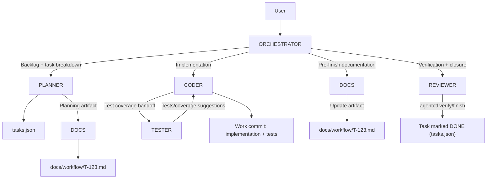
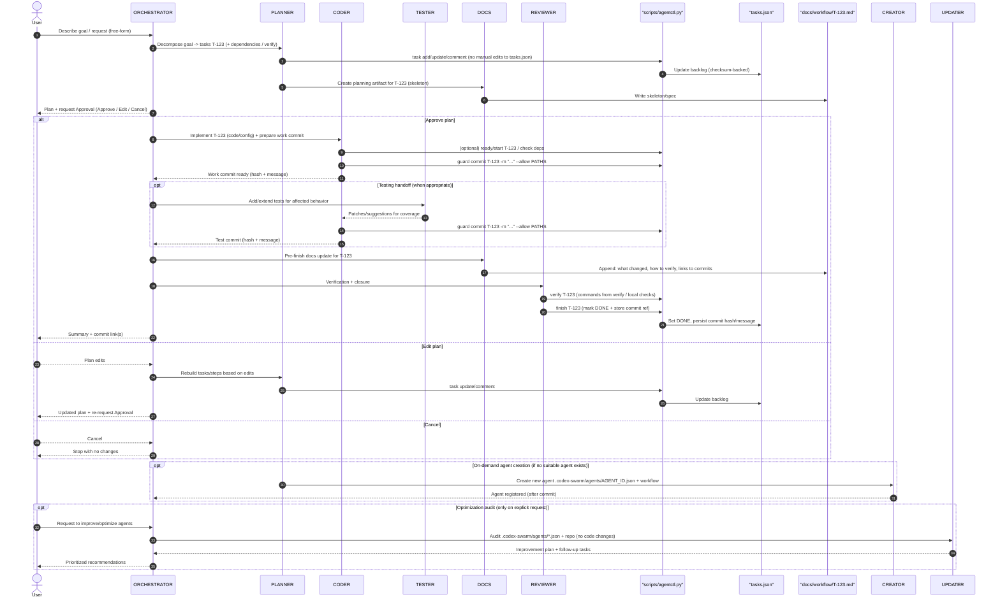

# Architecture & Workflow

This document expands on the concepts referenced in `README.md` and shows how the swarm fits together.

## What Codex Swarm is (and isn’t)

- Codex Swarm is a **prompt + JSON framework** designed to run inside your IDE via the OpenAI Codex plugin.
- There is **no separate runner/daemon**: all operations are local (git + files + shell commands you run).
- It is optimized for **human-in-the-loop** workflows: plans, approvals, commits, and verification are explicit.

## Core building blocks

1. **Global rules and the ORCHESTRATOR** live in `AGENTS.md`.
2. **Specialists** live in `.codex-swarm/agents/*.json` and are dynamically loaded by the orchestrator.
3. **Tasks** live in `tasks.json` and are the canonical source of truth.
4. **Task operations and git guardrails** flow through `python scripts/agentctl.py`.
5. **Per-task workflow artifacts** live under `docs/workflow/` as `T-###.md`.

## Default agent flow (Mermaid)

The typical development workflow is: plan the task, implement it, add test coverage, document the outcome, then verify + close.

## Detailed agent sequence (Mermaid)

## Extending beyond development

Nothing restricts agents to “coding”. By defining workflows in JSON you can build:

- Research agents that summarize docs before implementation.
- Compliance reviewers that check diffs/commits for policy violations.
- Ops/runbook agents that coordinate repetitive procedures.
- Documentation agents that keep guides synchronized with behavior changes.
